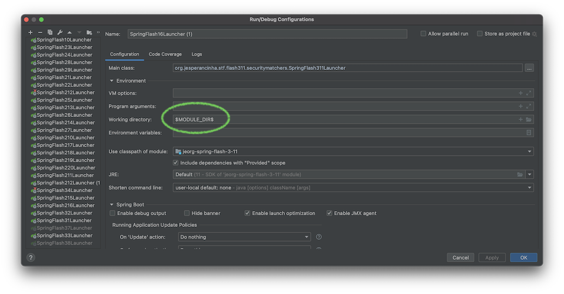

# spring-5 - Spring 5 Java

---
## Description

SPRING 5 study project.

This project is intended as a study tool for Spring version 5.

## Contents

1.  [spring-app-old](./spring-app-old) - 💾 Old applications present when this project started
2.  [spring-topics](./spring-topics) - 🗄 A set of Spring Boot applications exploring each relevant Spring topic per application
3.  [spring-flash](./spring-flash) - ⚡️ Fast track modules about Spring Boot 5
    1.  [spring-flash-set-1](./spring-flash/spring-flash-set-1) - ⚡️ Fast track modules about Spring Boot 5 - Set 1 with 20 modules
    2.  [spring-flash-set-2](./spring-flash/spring-flash-set-2) - ⚡️ Fast track modules about Spring Boot 5 - Set 2 with 20 modules
    3.  [spring-flash-set-3](./spring-flash/spring-flash-set-3) - ⚡️ Fast track modules about Spring Boot 5 - Set 3 with 20 modules
    4.  [spring-flash-set-4](./spring-flash/spring-flash-set-4) - ⚡️ Fast track modules about Spring Boot 5 - Set 4 with 4 modules
4.  [spring-apps](./spring-apps) - 💻 A set of applications for large topics
    1.  [spring-app-1](./spring-apps/spring-app-1) - 🛳 - Cruise Ships (JDBC and persistence)
5.  [spring-mastery](./spring-mastery) - ⚔️ Mastery modules - Each module is a combination of different concepts of the Spring framework
    1.  [spring-mastery-1](./spring-mastery/spring-mastery-1) - 🇫🇷 French Language in Music
    2.  [spring-mastery-2](./spring-mastery/spring-mastery-2) - 🇵🇹 Portuguese Language in Music
6.  [spring-action](./spring-action) - 🥋 Action Modules - Detailed studies separated by topics with the goal to disambiguate nuances and complicated concepts of the Spring Framework

## Installation Notes

I'm using JDK version 11.0.9.hs-adpt for all of these tests.

```bash
sdk install java 11.0.9.hs-adpt
sdk use 11.0.9.hs-adpt 
```

Many of the modules are using JSP's. For this you need to have your running path right. If you run spring boot from the command line, you should not see any issue:

```bash
mvn clean install spring-boot:run
```

On the other hand, if running through an IDE, the root path must be specified. In IntelliJ as an example:



## Resources

### Books

-   Cosmina, I. (11th December 2019). <i>Pivotal Certified Professional Core Spring 5 Developer Exam: A Study Guide Using Spring Framework 5</i>. (Second Edition). Apress
-   Sharma, R. (September 2018). <i>Hands-On Reactive Programming with Reactor</i>. (First Edition). Packt
-   Cosmina, I. Harrop, R. Schaefer, C. Ho, C. (October 2017). <i>Pro Spring 5 An In-Depth Guide to the Spring Framework and Its Tools</i>. (Fifth Edition). Apress
-   Winch, R. Mularien, P. (December 2012). <i>Spring Security 3.1</i>. (Second Edition). Packt Publishing
-   Kurniawan, B. Deck, P. (January 2015). <i>Servlet, JSP & Spring MVC</i>. (First Edition). Brainy Software
-   Long, J. (2020). <i>Reactive Spring</i>. (First Edition). Josh Long

### Online

-   [AOP Alliance (Java/J2EE AOP standards)](http://aopalliance.sourceforge.net/)
-   [Spring Framework Documentation 5.3.3](https://docs.spring.io/spring-framework/docs/5.3.3/reference/html/)
-   [VMware Spring Professional 2021 - EDU-1202](https://www.vmware.com/education-services/certification/vcp-spring.html)
-   [What’s new in Spring Framework 5](https://developer.ibm.com/languages/java/tutorials/j-whats-new-in-spring-framework-5-theedom)
-   [Spring Framework Overview](https://docs.spring.io/spring-framework/docs/5.1.18.RELEASE/spring-framework-reference/overview.html)

## About me

[](https://github.com/jesperancinha)
